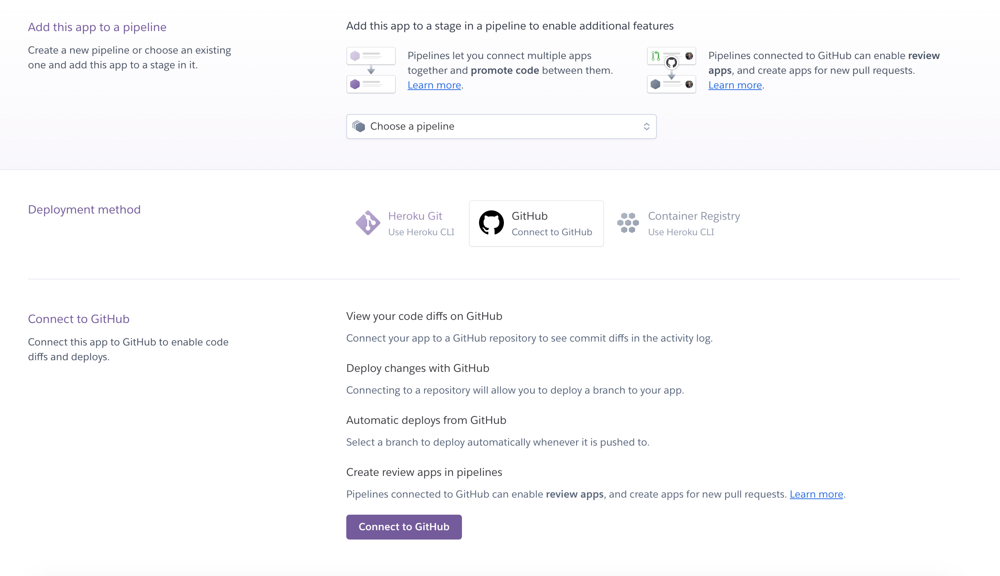
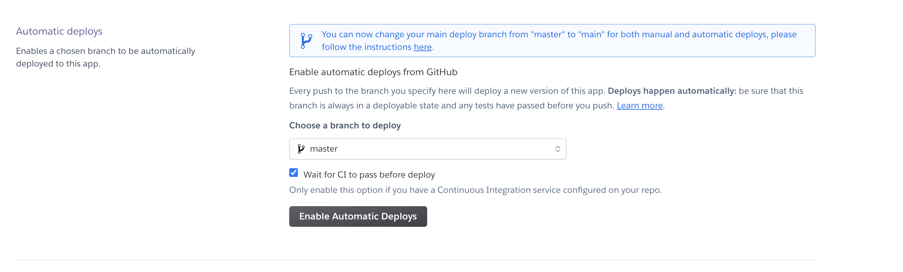
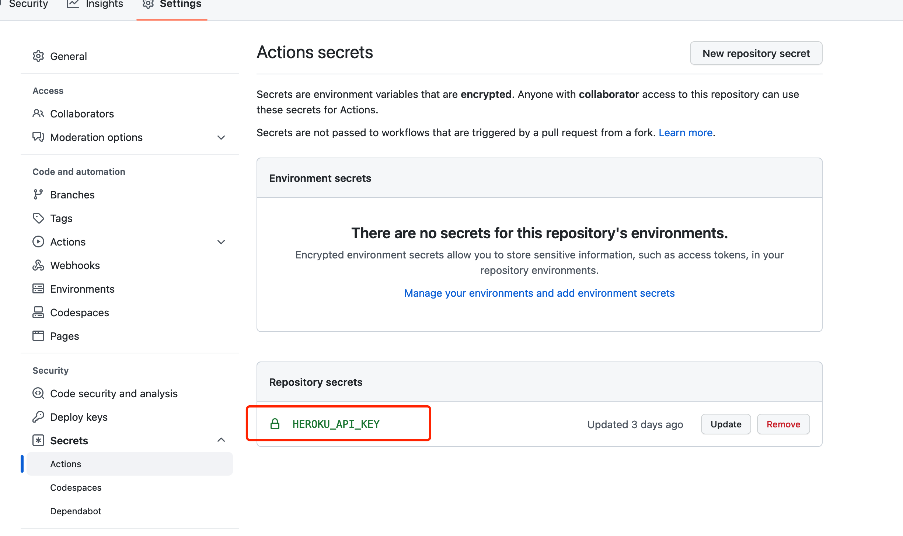

# Use Github + GitHub Actions + Heroku to deploy the project

based on : [https://github.com/TWweihuang/travis-heroku-demo](https://github.com/TWweihuang/travis-heroku-demo)

**Github** GitHub, Inc. is a provider of Internet hosting for software development and version control using Git. It offers the distributed version control and source code management (SCM) functionality of Git, plus its own features. It provides access control and several collaboration features such as bug tracking, feature requests, task management, continuous integration and wikis for every project. Headquartered in California, it has been a subsidiary of Microsoft since 2018.

**GitHub Actions** GitHub Actions makes it easy to automate all your software workflows, now with world-class CI/CD. Build, test, and deploy your code right from GitHub. Make code reviews, branch management, and issue triaging work the way you want.

**Heroku** Heroku is a cloud platform as a service (PaaS) supporting several programming languages. One of the first cloud platforms, Heroku has been in development since June 2007, when it supported only the Ruby programming language, but now supports Java, Node.js, Scala, Clojure, Python, PHP, and Go.[1] For this reason, Heroku is said to be a polyglot platform as it has features for a developer to build, run and scale applications in a similar manner across most languages.

### prerequisite

- Make sure you already have an account of [Github](https://github.com), please jump to the page to sign up if you haven't account yet.
- Make sure you have already configure the SSH keys, so that you could pull/push code from the local to the remote repository.  if not, please refer to the [Generating a new SSH key and adding it to the ssh-agent](https://docs.github.com/en/github/authenticating-to-github/connecting-to-github-with-ssh/generating-a-new-ssh-key-and-adding-it-to-the-ssh-agent) page.
- Make sure you already installed the [IntelliJ IDEA](https://www.jetbrains.com/idea/download) in your desktop,  please jump to the page to download and install to the local if not.

### create Spring Boot project by using IntelliJ IDEA
https://www.jetbrains.com/help/idea/your-first-spring-application.html

### create a private repository under your account on the Github
https://docs.github.com/en/get-started/quickstart/create-a-repo
> Push the Spring Boot project on local to the Github.
>
>**NOTE:** make sure the repository is private

### Heroku
- Create Heroku with your github account
- connect heroku to your github account.
  
- enable auto deploy
  

### Start the heroku console from the terminal

- [install heroku](https://devcenter.heroku.com/articles/heroku-cli)
- login heroku

```
heroku login
> note: will open the browser to auth
```
- generate the **Token** of the heroku
```
heroku authorizations:create
```

will generate:

```
Creating OAuth Authorization... done
Client:      <none>
ID:          7f750130-8992-47ec-99f5-0c9c66cf68e0
Description: Long-lived user authorization
Scope:       global
Token:       xxxxxx-xxxx-xxxx-xxxx-xxxxxxxxxxxx
Updated at:  Fri Aug 05 2022 10:34:53 GMT+0800 (China Standard Time) (less than a minute ago)
```

copy `Token` value to GitHub [Actions secrets](https://github.com/phodal/github-action-heroku/settings/secrets/actions) (replace `phodal/github-action-heroku` to your own repository name)



like: `HEROKU_API_KEY` (should be same with GitHub Actions config)

* Create Postgres database ( Don't use mysql )
    * [Install Heroku Postgres Add-Ons](https://github.com/qicaisheng/heroku-spring-demo/blob/master/document/install-heroku-postgres-add-ons.md)
* Copy GitHub Actions CI/CD config from [.github/workflows]

> contact: please feel free contact me if you meet any questions or have any concerns.