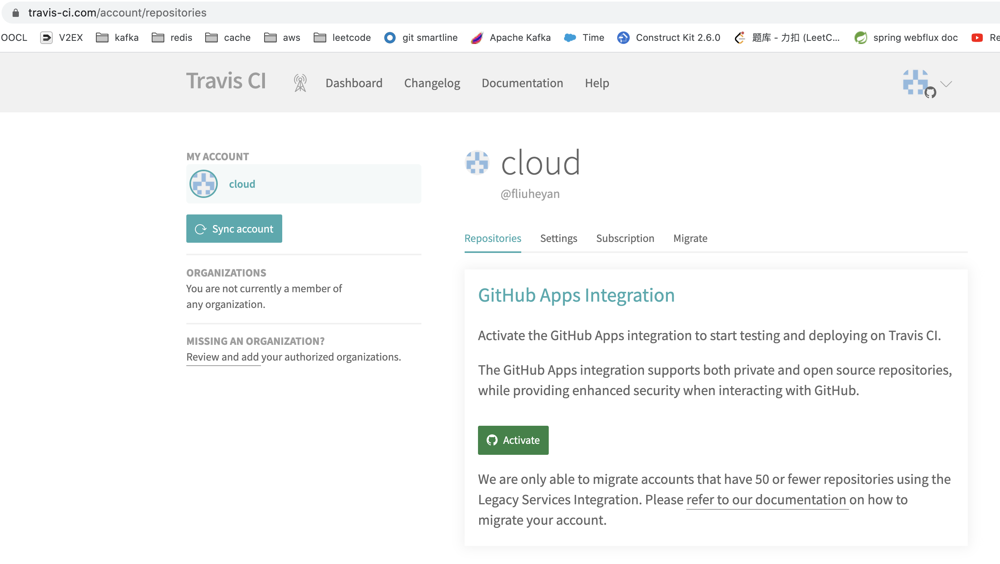

# Use Github + Travis CI + Heroku to deploy the project

@(Demo)[Github|Travis CI|Heroku]

**Github** GitHub, Inc. is a provider of Internet hosting for software development and version control using Git. It offers the distributed version control and source code management (SCM) functionality of Git, plus its own features. It provides access control and several collaboration features such as bug tracking, feature requests, task management, continuous integration and wikis for every project. Headquartered in California, it has been a subsidiary of Microsoft since 2018.

**Travis CI** As a continuous integration platform, Travis CI supports your development process by automatically building and testing code changes, providing immediate feedback on the success of the change. Travis CI can also automate other parts of your development process by managing deployments and notifications.

**Heroku** Heroku is a cloud platform as a service (PaaS) supporting several programming languages. One of the first cloud platforms, Heroku has been in development since June 2007, when it supported only the Ruby programming language, but now supports Java, Node.js, Scala, Clojure, Python, PHP, and Go.[1] For this reason, Heroku is said to be a polyglot platform as it has features for a developer to build, run and scale applications in a similar manner across most languages.

### prerequisite
- Make sure you already have an account of [Github](https://github.com), please jump to the page to sign up if you haven't account yet.
- Make sure you have already configure the SSH keys, so that you could pull/push code from the local to the remote repository.  if not, please refer to the [Generating a new SSH key and adding it to the ssh-agent](https://docs.github.com/en/github/authenticating-to-github/connecting-to-github-with-ssh/generating-a-new-ssh-key-and-adding-it-to-the-ssh-agent) page.
- Make sure you already installed the [IntelliJ IDEA](https://www.jetbrains.com/idea/download) in your desktop,  please jump to the page to download and install to the local if not.


### create Spring Boot project by using IntelliJ IDEA
https://www.jetbrains.com/help/idea/your-first-spring-application.html

### create a private repository under your account on the Github
https://docs.github.com/en/get-started/quickstart/create-a-repo
> Push the Spring Boot project on local to the Github.
>
>**NOTE:** make sure the repository is private

### Travis CI
- Login [travis ci](https://travis-ci.com/) with your github account
- approval and install travis ci for all your repositories.
  
- active github app integration
  

### Heroku
- Create Heroku with your github account
- connect heroku to your github account.
  
- enable auto deploy
  

### Start the heroku|travis console from the terminal
- [install travis](https://github.com/travis-ci/travis.rb#installation)
- [install heroku](https://devcenter.heroku.com/articles/heroku-cli)
- login travis
```
travis login --pro --github-token yourGitHubTokenHere
Github token you can find: github.com ->Settings->Developer settings->Personal Access Tokens or access this [link](https://github.com/settings/tokens)
```
- login heroku
```
heroku login
> note: will open the browser to auth
```
- generate the **api_key** of the heroku
```
travis encrypt $(heroku auth:token) --add deploy.api_key --pro
```
> please refer to the .travis.yml, and don't forget to replace your api key in the .travis.yml

* Create Postgres database ( Don't use mysql )
    * [Install Heroku Postgres Add-Ons](https://github.com/qicaisheng/heroku-spring-demo/blob/master/document/install-heroku-postgres-add-ons.md)
* Setup a [travis yml file](https://docs.travis-ci.com/user/deployment/heroku/);

> contact: please feel free contact me if you meet any questions or have any concerns.